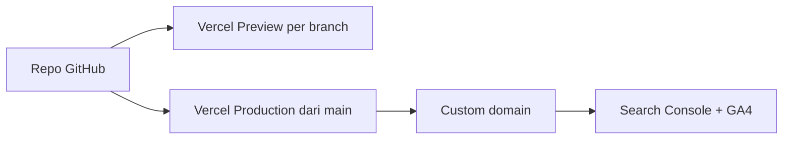

# 07. Deploy Vercel dan Domain

## Gambaran alur

## 1. Persiapan repo

- Repo privat di GitHub, branch utama `main`.
- Variabel lingkungan di Vercel (bukan di repo):

| Variabel | Contoh | Catatan |
|---|---|---|
| `NEXT_PUBLIC_SITE_URL` | `https://domainklien.com` | Dipakai sitemap, canonical, schema |
| `NEXT_PUBLIC_GA_ID` | `G-XXXXXXX` | Jika memakai GA4 |

## 2. Deploy pertama

1. Import repo di Vercel, framework terdeteksi Next.js otomatis.
2. Set variabel lingkungan untuk Production.
3. Deploy. Setiap push ke `main` akan membuat deploy produksi, branch lain membuat preview.

## 3. Mencegah preview dan `*.vercel.app` terindeks

Domain `*.vercel.app` dan URL preview **tidak boleh terindeks**, agar tidak jadi duplicate content dengan domain final.

- `robots.ts` (dokumen 05) sudah memblokir selain `VERCEL_ENV=production`.
- Pastikan domain produksi final sudah terpasang sebelum situs dibagikan publik.
- Jika URL `*.vercel.app` produksi masih bisa diakses setelah domain final aktif, arahkan redirect 301 ke domain final (aturan redirect di konfigurasi Next/Vercel) agar sinyal SEO menyatu.
- Di masa sementara (belum ada domain), batasi akses atau tambahkan `noindex` penuh.

## 4. Domain

| Hal | Saran |
|---|---|
| Kepemilikan | Daftarkan atas **nama klien** (bukan developer) |
| TLD | `.com` atau `.id` paling mudah; `.co.id` butuh dokumen badan usaha |
| Versi | Pilih satu canonical: non-www atau www, lalu redirect 301 yang lain |
| Registrar | Yang mendukung DNS mudah dikelola; simpan akses di tangan klien |

Langkah:

1. Tambahkan domain di Vercel (Project Settings, Domains).
2. Ikuti instruksi DNS yang ditampilkan Vercel (record A untuk apex dan CNAME untuk `www`, atau nameserver Vercel).
3. Tunggu propagasi, pastikan HTTPS aktif.
4. Perbarui `NEXT_PUBLIC_SITE_URL` lalu redeploy.

## 5. Catatan Vercel untuk situs bisnis

- **Terverifikasi (vercel.com/docs/plans/hobby, dibaca 1 Oktober 2026):** paket Hobby membatasi pengguna pada penggunaan non-komersial dan pribadi. Website bisnis klien adalah penggunaan komersial. Pakai Hobby hanya untuk pengembangan dan pratinjau internal. Sebelum tayang untuk klien yang membayar, gunakan paket Pro atau platform lain yang mengizinkan penggunaan komersial, dan masukkan biayanya ke penawaran.
- Karena situs statis, pindah hosting (Cloudflare Pages, Netlify, VPS) relatif mudah selama tidak memakai fitur spesifik Vercel yang berat.
- Catat biaya hosting dan domain dalam penawaran ke klien.

## 6. Setelah domain aktif

- [ ] Verifikasi properti di Google Search Console (disarankan metode DNS)
- [ ] Kirim `sitemap.xml`
- [ ] Minta pengindeksan halaman utama (Inspeksi URL)
- [ ] Pasang GA4 atau Vercel Analytics
- [ ] Uji Rich Results dan PageSpeed
- [ ] Perbarui URL website di Google Business Profile dan semua sosmed

## 7. Migrasi ke domain lain (jika suatu hari perlu)

1. Siapkan peta URL lama ke baru.
2. Pasang redirect 301 satu-ke-satu.
3. Gunakan fitur Change of Address di Search Console.
4. Perbarui sitemap, canonical, schema, GBP, dan backlink yang bisa diubah.
5. Pantau crawl error minggu-minggu awal.

## 8. Rutin pemeliharaan

| Frekuensi | Tugas |
|---|---|
| Mingguan | Cek error di Search Console dan uptime |
| Bulanan | Update dependensi, publikasi artikel, tinjau laporan SEO |
| Tahunan | Perpanjang domain, perbarui konten harga, audit SEO teknis |
