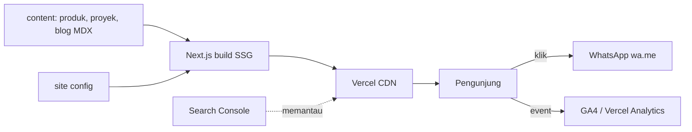
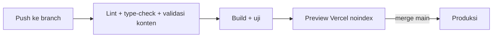

# 11. Dokumen Desain Teknis

## 1. Ringkasan arsitektur

Situs statis Next.js (App Router). Konten berasal dari file di repo (TypeScript dan MDX), dirender saat build, disajikan lewat CDN Vercel. Tidak ada database atau API server.



## 2. Stack

| Lapisan | Pilihan | Alasan |
|---|---|---|
| Framework | Next.js (App Router), TypeScript | SSG, Metadata API, sitemap/robots native |
| Styling | Tailwind CSS | Cepat, konsisten, bundle kecil |
| Konten blog | MDX (mis. `next-mdx-remote` atau `@next/mdx`) | Konten di repo, mudah dipindah ke CMS |
| Gambar | `next/image` | Optimasi otomatis |
| Font | `next/font` | Tanpa layout shift |
| Analitik | GA4 atau Vercel Analytics | Event WhatsApp |
| Hosting | Vercel | Mulus untuk Next.js |
| Linting | ESLint + Prettier | Kualitas kode |
| Pengujian | Playwright (E2E ringan) + Lighthouse | Lihat dokumen 12 |

Versi paket dipin saat scaffold; dokumentasikan di `package.json`.

## 3. Struktur direktori

```
src/
  app/
    layout.tsx
    page.tsx
    produk/page.tsx
    produk/plafon-pvc/page.tsx
    layanan/pasang-plafon-pvc/page.tsx
    layanan/harga-dan-biaya-pasang/page.tsx
    galeri/page.tsx
    area-layanan/[kota]/page.tsx
    blog/page.tsx
    blog/[slug]/page.tsx
    tentang-kami/page.tsx
    kontak/page.tsx
    sitemap.ts
    robots.ts
    not-found.tsx
  components/
    layout/ (Header, Footer, WhatsAppFloat, Breadcrumb)
    sections/ (Hero, ProductGrid, PriceTable, Gallery, Faq, Testimonials)
    seo/ (JsonLd)
    ui/ (Button, Card, Section)
  content/
    produk/*.ts
    proyek/*.ts
    area/*.ts
    blog/*.mdx
    faq.ts
  lib/
    site.ts
    seo.ts
    content.ts
    analytics.ts
public/
  images/...
docs/
```

## 4. Model data konten

Konten dipisah dari UI agar bisa dipindah ke CMS.

```ts
// content/produk/types.ts
export type Produk = {
  slug: string;
  nama: string;
  ringkasan: string;
  varian: { nama: string; motif: string; ukuran: string; tebal?: string; gambar: string; alt: string }[];
  hargaMulai?: number;      // IDR; hanya jika klien setuju menampilkan
  hargaSampai?: number;
  catatanHarga?: string;
  kelebihan: string[];
  faq: { q: string; a: string }[];
  diperbaruiPada: string;   // YYYY-MM-DD
};

// content/proyek/types.ts
export type Proyek = {
  slug: string;
  judul: string;
  lokasi: { kecamatan: string; kota: string };
  ruang: string;
  luasM2?: number;
  bahan: string;
  tahun: number;
  foto: { src: string; alt: string }[];
};

// content/area/types.ts
export type Area = {
  slug: string;              // mis. "cilegon"
  nama: string;
  ringkasan: string;         // unik per wilayah
  proyekSlugs: string[];
  faq: { q: string; a: string }[];
};
```

Validasi data saat build (mis. dengan Zod) agar tidak ada alt kosong, tanggal salah, atau slug duplikat; build gagal jika invalid.

## 5. Strategi rendering

| Halaman | Metode | Catatan |
|---|---|---|
| Semua halaman | SSG | `dynamicParams = false` untuk rute dinamis |
| Blog/area | `generateStaticParams` | Dari `content/` |
| Sitemap/robots | Dihasilkan saat build | Membedakan `VERCEL_ENV` |

Jika kelak butuh pembaruan tanpa deploy (CMS), gunakan ISR (`revalidate`) atau on-demand revalidation; bukan bagian MVP.

## 6. Komponen SEO

- `lib/seo.ts`: fungsi `buildMetadata({ title, description, path, image })` agar title/description/canonical/OG konsisten.
- `JsonLd`: komponen yang men-serialisasi objek schema dengan escape `<`.
- Fungsi schema: `localBusinessLd()`, `productLd(p)`, `serviceLd()`, `faqLd(items)`, `breadcrumbLd(trail)`, `articleLd(post)`.
- Semua schema dihasilkan dari data yang sama dengan UI agar tidak selisih.

## 7. Analitik dan event

```ts
// lib/analytics.ts
type EventName = "whatsapp_click" | "phone_click" | "map_click";
export function track(name: EventName, params: Record<string, string | number> = {}) {
  if (typeof window === "undefined") return;
  (window as any).gtag?.("event", name, params);
}
```

Pasang pada tombol WhatsApp, telepon, dan peta. Tidak mengirim data pribadi. Tampilkan pemberitahuan privasi jika diperlukan sesuai kebijakan klien.

## 8. Keamanan dan privasi

- Tidak ada input pengguna ke server pada MVP, sehingga permukaan serangan kecil.
- Tambahkan header keamanan dasar (contoh: `X-Content-Type-Options`, `Referrer-Policy`, `X-Frame-Options` atau CSP yang sesuai) lewat `next.config.ts`.
- Tautan eksternal dengan `rel="noopener noreferrer"`.
- Jangan menaruh rahasia di `NEXT_PUBLIC_*`.
- Nomor WhatsApp bisnis memang publik; tetap hindari mengekspos data pribadi pelanggan (testimoni hanya dengan izin).

## 9. Variabel lingkungan

| Variabel | Wajib | Keterangan |
|---|---|---|
| `NEXT_PUBLIC_SITE_URL` | Ya | URL kanonik produksi |
| `NEXT_PUBLIC_GA_ID` | Tidak | ID GA4 |

## 10. Pipeline



Lint, type-check, dan validasi data dijalankan di CI (GitHub Actions) atau build Vercel.

## 11. Keputusan arsitektur (ADR ringkas)

| # | Keputusan | Alternatif | Alasan | Konsekuensi |
|---|---|---|---|---|
| ADR-1 | SSG tanpa backend | Laravel/PHP | Cepat, murah, cocok Vercel | Update konten lewat developer |
| ADR-2 | Konten di repo (TS + MDX) | CMS sejak awal | Scope kecil, klien tidak mengedit | Perlu migrasi bila klien ingin mengedit |
| ADR-3 | WhatsApp sebagai konversi utama | Formulir + email | Kebiasaan pengguna lokal | Tidak ada lead tersimpan; lacak lewat event analitik |
| ADR-4 | Halaman area hanya untuk wilayah yang dilayani | Halaman semua kota | Hindari doorway page | Lebih sedikit halaman, kualitas lebih tinggi |
| ADR-5 | Vercel sebagai hosting sementara | Cloudflare Pages/VPS | Kemudahan | Cek ketentuan komersial; rencana pindah bila perlu |

## 12. Batasan dan keterbatasan

- Tanpa penyimpanan lead di server; hanya event analitik.
- Pembaruan harga dan galeri memerlukan commit dan deploy.
- Kode di dokumen 05 belum diuji; verifikasi saat implementasi.
