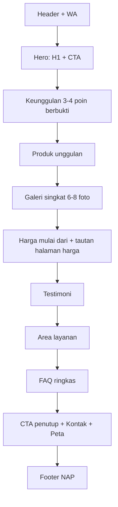

# 12. Panduan Desain UI dan Konten

> **Sumber kebenaran token visual (warna, font, radius, komponen, aturan anti AI slop) adalah [../DESIGN.md](../DESIGN.md).** Dokumen ini tetap dipakai untuk struktur halaman, aksesibilitas, dan gaya tulisan. Jika ada perbedaan nilai, DESIGN.md yang berlaku.

Panduan awal. Finalkan warna dan gaya setelah logo dan materi brand klien diterima. Nilai bertanda `[ISI]` menunggu keputusan desain.

## 1. Prinsip desain

1. **Mobile-first**: pengunjung kemungkinan besar dari HP.
2. **Bukti sebelum klaim**: foto proyek asli, harga, dan lokasi lebih meyakinkan daripada slogan.
3. **Satu tujuan per layar**: hubungi lewat WhatsApp.
4. **Cepat dan ringan**: tanpa animasi berat atau slider otomatis.
5. **Jujur**: tidak ada klaim ("termurah", "terbaik", persentase peminat) tanpa dasar.

## 2. Token desain

| Token | Nilai awal | Catatan |
|---|---|---|
| Warna primer | `[ISI dari logo]` | Kontras teks/tombol minimal 4,5:1 |
| Warna aksen CTA | Hijau WhatsApp atau warna brand `[ISI]` | Tombol CTA harus menonjol |
| Netral | Skala abu-abu Tailwind | Latar dan teks |
| Font | 1 keluarga sans-serif via `next/font` | Maksimal 2 bobot utama |
| Radius | 8-12 px | Konsisten |
| Spasi | Skala 4 px | Gunakan utilitas Tailwind |
| Lebar konten | Maks ~1200 px, teks artikel ~65-75 karakter per baris | Keterbacaan |

## 3. Titik henti responsif

| Nama | Lebar |
|---|---|
| Mobile | 360-639 px |
| Tablet | 640-1023 px |
| Desktop | 1024 px ke atas |

Uji minimal di 360, 390, 768, dan 1280 px.

## 4. Komponen

| Komponen | Perilaku |
|---|---|
| Header | Logo, menu, tombol WhatsApp; menu hamburger di mobile |
| Tombol WhatsApp floating | Pojok kanan bawah mobile; tidak menutupi tombol utama; label aksesibel "Chat WhatsApp" |
| Hero | H1, subjudul (produk + kota), CTA primer (WhatsApp), CTA sekunder (lihat galeri/harga), gambar asli |
| Kartu produk | Gambar, nama, rentang harga, tombol tanya |
| Tabel harga | Responsif (kartu di mobile), tanggal pembaruan, catatan |
| Galeri | Grid, lazy load, lightbox sederhana dengan fokus keyboard |
| Bagian FAQ | Accordion aksesibel (`button` + `aria-expanded`) |
| Testimoni | Kutipan, nama/inisial, lokasi; hanya dengan izin |
| Breadcrumb | Sinkron dengan schema |
| Footer | NAP (teks), jam, tautan sosmed, tautan area layanan |

## 5. Wireframe Home (urutan bagian)

## 6. Panduan gambar

- Foto proyek asli; hindari foto stok.
- Format WebP/AVIF, sisi panjang 1600 px untuk hero/galeri, lebih kecil untuk kartu.
- Nama file deskriptif dengan tanda hubung: `plafon-pvc-motif-kayu-ruang-tamu-serang.webp`.
- Alt text menjelaskan isi nyata: jenis plafon, ruang, dan lokasi bila relevan. Bukan sekadar mengulang keyword.
- Tentukan `width`/`height` untuk menghindari layout shift; gambar LCP diberi `priority`.

## 7. Aksesibilitas

- Kontras warna memadai; jangan mengandalkan warna saja.
- Semua kontrol dapat dioperasikan keyboard dengan fokus terlihat.
- Heading berurutan (satu H1, lalu H2, H3).
- Tombol ikon memiliki label teks aksesibel.
- Target sentuh minimal ~44x44 px.
- Hormati `prefers-reduced-motion`.

## 8. Gaya tulisan (copywriting)

- Bahasa Indonesia yang jelas dan hangat; hindari jargon berlebihan.
- Kalimat pendek; jawaban di awal paragraf.
- Sebut manfaat nyata: tahan lembap, tidak dimakan rayap, perawatan mudah, pemasangan cepat; **hanya** bila benar untuk produk klien.
- Jangan membuat klaim kuantitatif tanpa sumber.
- Jangan "keyword stuffing"; sebut keyword utama secara natural di title, H1, paragraf awal.
- CTA spesifik: "Tanya harga via WhatsApp", bukan "Hubungi admin".

### Contoh pesan WhatsApp prefilled

| Halaman | Pesan |
|---|---|
| Umum | `Halo Anugerah Plafon PVC, saya ingin tanya plafon PVC.` |
| Produk | `Halo, saya tertarik dengan plafon PVC motif [nama]. Boleh tahu harga dan ketersediaannya?` |
| Jasa | `Halo, saya ingin minta estimasi biaya pasang plafon PVC di [lokasi], luas sekitar [m²].` |

## 9. Konten per halaman: panduan isi

| Halaman | Bagian dan catatan |
|---|---|
| Home | Lihat wireframe; keyword utama di H1 |
| Produk | Varian, spesifikasi, kelebihan, perbandingan jujur dengan alternatif, FAQ |
| Harga | Rentang, faktor, contoh hitungan 3x3 m, tanggal pembaruan, cara mendapatkan penawaran |
| Jasa | Proses (survei, pengukuran, pemasangan, finishing), garansi nyata, contoh proyek |
| Galeri | Filter per jenis ruang (opsional), keterangan lokasi |
| Area | Konten unik, proyek lokal, FAQ wilayah |
| Tentang | Cerita, tim, pengalaman, legalitas |
| Kontak | NAP teks, jam, peta, WhatsApp, tautan sosmed |

## 10. Checklist desain sebelum implementasi

- [ ] Logo dan warna brand diterima
- [ ] Gaya dan referensi disepakati dengan klien
- [ ] Wireframe Home dan Produk disetujui
- [ ] Semua teks inti siap (atau draf disetujui)
- [ ] Foto minimum tersedia
