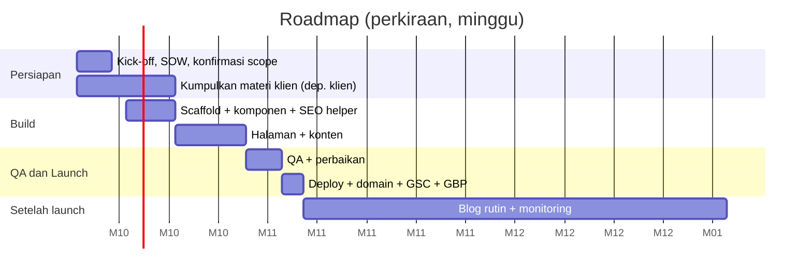
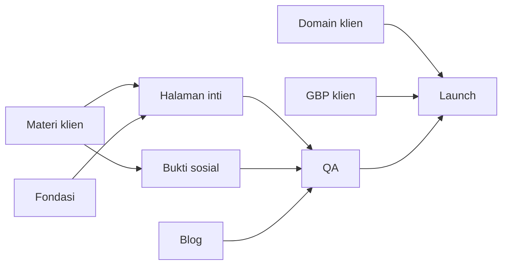

# 14. Roadmap dan Task Breakdown

Estimasi waktu bersifat perkiraan awal dan bergantung kecepatan materi klien. Sesuaikan setelah scope final dan ketersediaan Anda. Fase dengan dependensi klien ditandai.

## 1. Gambaran roadmap

Tanggal pada diagram hanya ilustrasi; ubah mengikuti tanggal mulai sebenarnya.

## 2. Fase dan milestone

| Milestone | Isi | Kriteria selesai |
|---|---|---|
| M0 Kick-off | SOW ditandatangani, scope dikonfirmasi, checklist materi dikirim | Persetujuan tertulis klien |
| M1 Fondasi | Repo, scaffold Next.js, tema, layout, `site.ts`, SEO helper, sitemap/robots | Build hijau, deploy preview noindex |
| M2 Halaman inti | Home, Produk, Layanan, Harga, Kontak, Tentang | Konten placeholder terganti data klien |
| M3 Bukti sosial | Galeri, testimoni, area layanan (yang dilayani) | Min. 15 proyek |
| M4 Blog | Mesin MDX + 3 artikel awal | Artikel terbit, schema Article |
| M5 QA | Semua uji dokumen 13 | Kriteria lulus rilis terpenuhi |
| M6 Launch | Domain, HTTPS, GSC, GBP, analitik | Checklist launch PRD lengkap |
| M7 Pasca-launch | Pemantauan minggu 2, laporan bulan 1 | Laporan terkirim |

## 3. Task breakdown

Status: `[ ]` belum, `[~]` berjalan, `[x]` selesai. Ukuran: S (<0,5 hari), M (0,5-1 hari), L (1-2 hari).

### M0 Persiapan

- [ ] Finalisasi dan kirim SOW (dokumen 15) ke klien (S)
- [ ] Kirim checklist materi (dokumen 04) dan tenggat (S)
- [ ] Jawab pertanyaan terbuka PRD bagian 11 (S)
- [ ] Bantu klien membuat/klaim Google Business Profile (M, dep. klien)
- [ ] Putuskan domain dan registrar atas nama klien (S, dep. klien)

### M1 Fondasi

- [ ] Inisialisasi repo dan Next.js + TypeScript + Tailwind (S)
- [ ] ESLint, Prettier, husky/lint-staged (opsional) (S)
- [ ] `lib/site.ts`, `lib/seo.ts`, komponen `JsonLd` (M)
- [ ] `sitemap.ts`, `robots.ts` dengan logika `VERCEL_ENV` (S)
- [ ] Layout global: Header, Footer, Breadcrumb, WhatsAppFloat (M)
- [ ] Token desain dan komponen UI dasar (M)
- [ ] Model data + validasi Zod untuk `content/` (M)
- [ ] Hubungkan repo ke Vercel, preview noindex (S)

### M2 Halaman inti

- [ ] Home sesuai wireframe (L)
- [ ] Produk listing + detail plafon PVC (L)
- [ ] Layanan pasang plafon PVC (M)
- [ ] Halaman harga dan biaya pasang + contoh hitungan (M)
- [ ] Tentang Kami (S)
- [ ] Kontak: NAP teks, peta, tombol WA/arah (M)
- [ ] 404 kustom (S)
- [ ] Schema LocalBusiness, Product/Service, Breadcrumb (M)

### M3 Bukti sosial

- [ ] Manifest aset, komponen `Asset`, dan pemeriksaan build produksi (docs/16) (M)
- [ ] Setup Motion: `MotionConfig`, komponen `Reveal`, animasi sesuai katalog DESIGN.md (M)
- [ ] Penggantian placeholder dengan aset final oleh pemilik proyek (L, dep. aset)
- [ ] Galeri proyek dari `content/proyek` (M)
- [ ] Bagian testimoni (S)
- [ ] Halaman area layanan dinamis + konten unik per wilayah (L)
- [ ] FAQ per halaman + FAQPage schema (M)

### M4 Blog

- [ ] Setup MDX, daftar blog, halaman artikel, daftar isi (L)
- [ ] Artikel terkait dan internal link (S)
- [ ] Tulis artikel #1 harga, #2 hitungan 3x3, #3 PVC vs gypsum (dokumen 06) (L x3)
- [ ] Schema Article + sitemap blog (S)

### M5 QA

- [ ] Jalankan uji fungsional T-01 sampai T-10 (M)
- [ ] Audit SEO S-01 sampai S-12 (M)
- [ ] Lighthouse/PageSpeed Home, Produk, Blog; perbaiki (M)
- [ ] Uji aksesibilitas dan lintas perangkat (M)
- [ ] Review konten oleh klien dan persetujuan tertulis (S, dep. klien)

### M6 Launch

- [ ] Pasang domain di Vercel, DNS, HTTPS (S, dep. klien)
- [ ] Set `NEXT_PUBLIC_SITE_URL` produksi, redeploy (S)
- [ ] Redirect www/non-www dan `*.vercel.app` (S)
- [ ] Verifikasi Search Console (DNS), kirim sitemap, minta indeks halaman utama (S)
- [ ] Pasang GA4/Vercel Analytics + event (M)
- [ ] Perbarui URL di GBP dan sosmed, isi `sameAs` (S)
- [ ] Uji Rich Results pada produksi (S)

### M7 Pasca-launch

- [ ] Minggu 2: cek indexing, error, query awal (S)
- [ ] Bulan 1: laporan pertama (M)
- [ ] Bulan 1-3: 2 artikel per bulan (L x6)
- [ ] Bulan 3: tinjau keyword map dengan data Search Console (M)

## 4. Dependensi kritis

Jalur kritis: **materi klien** dan **domain**. Bila terlambat, kerjakan M1 dan kerangka M2 dengan data dummy yang jelas ditandai, lalu ganti sebelum QA.

## 5. Risiko jadwal

| Risiko | Dampak | Respons |
|---|---|---|
| Materi klien terlambat | Mundur M2-M3 | Tenggat tertulis, kerjakan fondasi lebih dulu |
| Revisi berulang | Mundur M5 | Batasi ronde revisi di SOW |
| Verifikasi GBP lambat | Mundur pengukuran lokal | Mulai lebih awal, paralel dengan build |
| Domain `.co.id` butuh dokumen | Mundur M6 | Mulai dengan `.com`/`.id` jika mendesak |

## 6. Backlog fase 2

- CMS (pilih setelah kebutuhan edit klien jelas)
- Kalkulator estimasi biaya interaktif
- Formulir survei lokasi + penyimpanan lead
- Tampilkan review Google di web
- Halaman motif per produk
- Kampanye Google Ads (terpisah dari scope)
