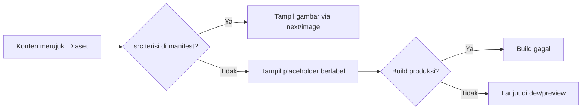

# 16. Daftar Aset dan Sistem Placeholder

Semua aset visual dibuat oleh pemilik proyek. Kode hanya menyediakan **slot** bertanda ID. Dokumen ini adalah sumber daftar slot, spesifikasi, dan cara menggantinya.

Jumlah proyek, motif, dan wilayah bertanda `[ISI]` menunggu data klien.

## 1. Cara kerja



Langkah mengganti placeholder:

1. Siapkan file sesuai spesifikasi tabel di bawah.
2. Simpan di `public/assets/<kategori>/<nama-berkas>`.
3. Isi `src` dan `alt` pada ID terkait di `src/content/assets.ts`.
4. Jalankan `next build`; tidak ada perubahan tata letak yang diperlukan.

## 2. Spesifikasi umum

| Item | Ketentuan |
|---|---|
| Format sumber | JPEG atau WebP untuk foto, SVG untuk logo, PNG hanya bila butuh transparansi |
| Warna | sRGB |
| Ukuran | Sisi panjang minimal sesuai tabel; lebih besar boleh, `next/image` yang mengecilkan |
| Bobot | Usahakan di bawah sekitar 500 KB per foto setelah ekspor (pedoman internal) |
| Penamaan | huruf kecil, tanda hubung, deskriptif: `plafon-pvc-motif-kayu-ruang-tamu-serang.webp` |
| Isi | Tanpa watermark pihak lain, tanpa filter berat, milik sendiri atau berizin |
| Alt text | Deskripsi isi nyata (jenis plafon, ruang, lokasi), diisi di manifest saat aset final |
| Video | Pendek, tanpa autoplay bersuara; wajib ada gambar poster |

Konvensi file ikon dan gambar OG bawaan Next.js (`icon`, `apple-icon`, `opengraph-image`) disebut pada panduan upgrade Next.js 16; konfirmasi nama dan format yang didukung di dokumentasi saat implementasi.

## 3. Daftar slot aset

Status: `[ ]` belum dibuat, `[x]` selesai dan terpasang.

### Brand

| ID | Dipakai di | Rasio | Ukuran minimum | Isi yang dibutuhkan | Status |
|---|---|---|---|---|---|
| LOGO-01 | Header, footer | Bebas | SVG | Logo horizontal | [ ] |
| LOGO-02 | Favicon, avatar sosmed | 1:1 | SVG + PNG 512 px | Logo ringkas | [ ] |
| OG-DEFAULT | Pratinjau tautan (default) | 1200:630 | 1200 x 630 | Gambar berbagi tautan berisi nama usaha dan produk | [ ] |

### Hero dan Home

| ID | Dipakai di | Rasio | Ukuran minimum | Isi yang dibutuhkan | Status |
|---|---|---|---|---|---|
| HERO-01 | Hero Home (desktop dan mobile) | 4:3 | 1600 x 1200 | Ruangan dengan plafon PVC terpasang terlihat jelas, cahaya alami; sisakan ruang aman di tepi untuk pemotongan mobile | [ ] |

### Katalog motif (jumlah `[ISI]`, contoh 8)

| ID | Dipakai di | Rasio | Ukuran minimum | Isi yang dibutuhkan | Status |
|---|---|---|---|---|---|
| MOTIF-01 sampai MOTIF-NN | Katalog dan halaman produk | 1:1 | 800 x 800 | Close-up satu motif, pencahayaan sama untuk semua | [ ] |
| DETAIL-01 | Halaman produk | 4:3 | 1200 x 900 | Sambungan dan profil panel dari dekat | [ ] |
| DETAIL-02 | Halaman produk | 4:3 | 1200 x 900 | Perbandingan sudut pemasangan atau finishing | [ ] |

### Proyek dan galeri (jumlah `[ISI]`, minimal 15)

| ID | Dipakai di | Rasio | Ukuran minimum | Isi yang dibutuhkan | Status |
|---|---|---|---|---|---|
| PROJ-01-SESUDAH sampai PROJ-NN-SESUDAH | Galeri, Home, area layanan | 4:3 | 1600 x 1200 | Hasil akhir; catat kecamatan, jenis ruang, luas, bahan, tahun | [ ] |
| PROJ-01-SEBELUM sampai PROJ-NN-SEBELUM | Penggeser sebelum/sesudah | 4:3 | 1600 x 1200 | Kondisi awal dari **sudut yang sama** dengan foto sesudah (tidak semua proyek wajib punya) | [ ] |

### Proses, tentang, area

| ID | Dipakai di | Rasio | Ukuran minimum | Isi yang dibutuhkan | Status |
|---|---|---|---|---|---|
| PROSES-01 sampai PROSES-04 | Bagian cara kerja | 3:2 | 1200 x 800 | Survei, pengukuran, pemasangan, finishing | [ ] |
| TOKO-01 | Tentang dan Kontak | 3:2 | 1600 x 1067 | Tampak depan toko/gudang | [ ] |
| TIM-01 | Tentang | 3:2 | 1600 x 1067 | Tim di lokasi kerja | [ ] |
| AREA-`<kota>`-01 | Halaman area layanan | 3:2 | 1200 x 800 | Proyek nyata di wilayah itu (hanya untuk wilayah yang dilayani) | [ ] |

### Blog

| ID | Dipakai di | Rasio | Ukuran minimum | Isi yang dibutuhkan | Status |
|---|---|---|---|---|---|
| BLOG-01 sampai BLOG-03 | Sampul artikel | 16:9 | 1600 x 900 | Gambar yang relevan dengan artikel (foto atau diagram buatan sendiri) | [ ] |
| OG-BLOG-01 sampai 03 | Pratinjau tautan artikel | 1200:630 | 1200 x 630 | Judul artikel dan merek | [ ] |

### Opsional

| ID | Dipakai di | Spesifikasi | Status |
|---|---|---|---|
| VIDEO-01 | Halaman layanan atau Home | Klip pemasangan 10-30 detik, tanpa suara wajib, dengan poster (ID POSTER-VIDEO-01, 16:9) | [ ] |
| ILLUS-xx | Ilustrasi khas brand jika diinginkan | SVG, mengikuti palet DESIGN.md | [ ] |

Yang **bukan** aset: garis sambungan panel (CSS), ikon fungsional (pustaka ikon), foto testimoni (pakai inisial), peta (embed).

## 4. Kode: manifest dan komponen

Contoh awal, belum dijalankan. Verifikasi API `next/image` di dokumentasi versi terpasang saat implementasi.

```ts
// src/content/assets.ts
export type AssetSpec = {
  ratio: string;       // "4/3"
  minWidth: number;
  minHeight: number;
  brief: string;       // isi yang diminta, tampil di placeholder
  src?: string;        // "/assets/hero/hero-01.webp"
  alt?: string;        // wajib jika src terisi
};

export const assets = {
  "HERO-01": {
    ratio: "4/3", minWidth: 1600, minHeight: 1200,
    brief: "Ruangan dengan plafon PVC terpasang, cahaya alami",
  },
  "MOTIF-01": {
    ratio: "1/1", minWidth: 800, minHeight: 800,
    brief: "Close-up motif 01",
  },
  // ... lanjutkan sesuai daftar slot
} satisfies Record<string, AssetSpec>;

export type AssetId = keyof typeof assets;
```

```tsx
// src/components/asset.tsx
import Image from "next/image";
import { assets, type AssetId, type AssetSpec } from "@/content/assets";

type Props = { id: AssetId; sizes: string; priority?: boolean; className?: string };

export function Asset({ id, sizes, priority = false, className = "" }: Props) {
  const spec: AssetSpec = assets[id];
  const box = `relative overflow-hidden bg-panel ${className}`;
  const style = { aspectRatio: spec.ratio };

  if (spec.src) {
    if (!spec.alt) throw new Error(`Aset ${id} punya src tetapi alt kosong`);
    return (
      <div className={box} style={style}>
        <Image src={spec.src} alt={spec.alt} fill sizes={sizes} priority={priority} className="object-cover" />
      </div>
    );
  }

  // Produksi tidak boleh memuat placeholder.
  if (process.env.VERCEL_ENV === "production") {
    throw new Error(`Aset ${id} belum diisi; build produksi dihentikan`);
  }

  return (
    <div
      className={`${box} flex items-end border border-line`}
      style={{
        ...style,
        backgroundImage:
          "repeating-linear-gradient(135deg, transparent 0 11px, rgba(27,26,23,0.06) 11px 12px)",
      }}
      aria-hidden="true"
    >
      <p className="m-3 font-display text-xs uppercase tracking-[0.08em] text-ink-muted">
        {id} | {spec.ratio.replace("/", ":")} | min {spec.minWidth}x{spec.minHeight} | {spec.brief}
      </p>
    </div>
  );
}
```

Catatan:

- Kelas `bg-panel`, `border-line`, `text-ink-muted`, `font-display` berasal dari token `@theme` di [../DESIGN.md](../DESIGN.md).
- Placeholder memakai `aria-hidden` dan tidak mengirim alt; aset final wajib beralt.
- `VERCEL_ENV` sama dengan yang dipakai untuk `robots.ts` di dokumen 05, sehingga pratinjau tetap bisa dibuka dengan placeholder.
- Tambahkan skrip pemeriksa opsional yang mendaftar ID dengan `src` kosong untuk laporan kemajuan.

## 5. Aturan untuk kode dan agent

- Dilarang mengambil gambar dari internet atau membuat gambar pengganti. Selalu pakai `<Asset id="..." />`.
- ID baru harus ditambahkan ke tabel di dokumen ini dan ke manifest pada commit yang sama.
- Jangan mengubah rasio slot tanpa memperbarui dokumen ini dan DESIGN.md.
- Tata letak harus tetap benar dengan placeholder maupun aset final (tanpa layout shift).

## 6. Pelacakan kemajuan

| Kategori | Total slot | Selesai |
|---|---|---|
| Brand | 3 | 0 |
| Hero | 1 | 0 |
| Katalog motif | `[ISI]` + 2 detail | 0 |
| Proyek | `[ISI]` (sesudah) + sebelum | 0 |
| Proses, tentang, area | 6 + area | 0 |
| Blog | 6 | 0 |
