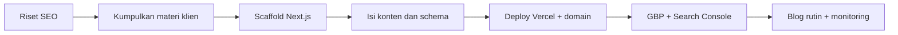

# Dokumentasi Proyek: Web Company Profile Anugerah Plafon PVC

Dokumen perencanaan untuk website company profile Anugerah Plafon PVC (Serang, Banten) dengan fokus SEO, hosting sementara di Vercel.

Status: **perencanaan**. Bagian bertanda `[ISI]` menunggu data dari klien.

## Daftar dokumen

| No | File | Isi |
|---|---|---|
| 01 | [01-project-brief.md](01-project-brief.md) | Tujuan, scope, stack, keputusan yang sudah diambil, risiko |
| 02 | [02-sitemap-dan-struktur-halaman.md](02-sitemap-dan-struktur-halaman.md) | Sitemap, URL, isi tiap halaman |
| 03 | [03-keyword-map.md](03-keyword-map.md) | Keyword per halaman dan intent |
| 04 | [04-checklist-materi-klien.md](04-checklist-materi-klien.md) | Data dan aset yang harus dikumpulkan dari klien |
| 05 | [05-spesifikasi-teknis-seo.md](05-spesifikasi-teknis-seo.md) | Metadata, schema JSON-LD, sitemap, robots, performa |
| 06 | [06-rencana-konten-blog.md](06-rencana-konten-blog.md) | Kalender dan outline artikel |
| 07 | [07-deploy-vercel-dan-domain.md](07-deploy-vercel-dan-domain.md) | Deploy, domain, migrasi, noindex preview |
| 08 | [08-local-seo-dan-monitoring.md](08-local-seo-dan-monitoring.md) | Google Business Profile, direktori, Search Console, laporan |
| 09 | [09-prd.md](09-prd.md) | Product Requirements Document: tujuan, scope, FR/NFR, risiko, kriteria launch |
| 10 | [10-user-stories-dan-acceptance.md](10-user-stories-dan-acceptance.md) | User stories, acceptance criteria, matriks keterlacakan |
| 11 | [11-desain-teknis.md](11-desain-teknis.md) | Arsitektur, stack, model data, rendering, analitik, ADR |
| 12 | [12-desain-ui-dan-konten.md](12-desain-ui-dan-konten.md) | Token desain, komponen, wireframe Home, aksesibilitas, copywriting |
| 13 | [13-rencana-qa-dan-testing.md](13-rencana-qa-dan-testing.md) | Uji fungsional, SEO, performa, aksesibilitas, kriteria rilis |
| 14 | [14-roadmap-dan-task-breakdown.md](14-roadmap-dan-task-breakdown.md) | Milestone, Gantt, daftar task, dependensi |
| 15 | [15-sow-ruang-lingkup-kerja.md](15-sow-ruang-lingkup-kerja.md) | Draf SOW untuk klien: deliverables, revisi, biaya, ekspektasi SEO |
| 16 | [16-daftar-aset-placeholder.md](16-daftar-aset-placeholder.md) | Daftar slot aset, spesifikasi, sistem placeholder, kode komponen `Asset` |
| 17 | [17-peta-data-dummy.md](17-peta-data-dummy.md) | Peta data contoh ke berkas dan sumbernya, langkah rilis |

## File aturan di root proyek

| File | Isi |
|---|---|
| [../AGENTS.md](../AGENTS.md) | Aturan kode: verifikasi lewat browser, versi 2026, aturan Next.js 16 dan Tailwind 4, dokumentasi, tanpa emoji |
| [../CLAUDE.md](../CLAUDE.md) | Mengimpor AGENTS.md untuk Claude Code |
| [../DESIGN.md](../DESIGN.md) | Sistem desain: token, referensi, aturan anti AI slop, komponen, implementasi |

Laporan riset awal: [../riset-seo-anugerah-plavon-pvc.md](../riset-seo-anugerah-plavon-pvc.md)

## Urutan pengerjaan

## Catatan penting

- Semua angka volume pencarian **belum ada**. Validasi dengan Google Keyword Planner dan Search Console.
- Jangan menyalin harga dari artikel riset ke website. Gunakan harga asli klien.
